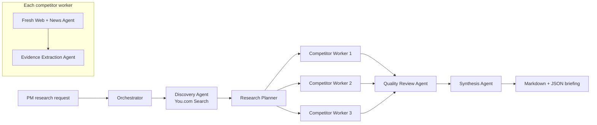

# Market Intelligence Orchestrator

A multi-agent competitor-research system for PMs, strategy teams, consultants, and founders. It discovers a target company's top competitors, gathers current web and news evidence in parallel, extracts decision-useful intelligence, quality-checks the evidence, and produces a cited briefing in a Streamlit web app.

## Product goal

This agent helps **product managers** perform competitive intelligence, client research, market monitoring, and industry tracking in a web app, replacing hours of manual research. It autonomously searches across multiple sources, evaluates the evidence, and hands off an actionable briefing to the PM.

The product succeeds when a PM can produce usable research in **under 30 minutes** that they would confidently send to their team **at least 8 times out of 10**.

The default use case is **NVIDIA / AI Chips / top 3 competitors**, but the target, category, geography, audience, and research questions are configurable.

For a zero-cost project review, click **Load project-review demo** in the sidebar. It immediately displays a prepared NVIDIA briefing and exercises the report layout, citations, action plan, cost panel, and Markdown/JSON downloads without calling You.com or OpenAI. The demo is clearly labeled so it cannot be mistaken for a fresh research run.

A recorded walkthrough is saved at `demo/market-intelligence-orchestrator-demo.webm`. To record a new version while Streamlit is running, install the demo extra and run `python scripts/record_demo.py`.

## Workflow



LangGraph's `Send` API fans competitor workers out in parallel. Reducer-backed state accumulates results safely, while an in-memory checkpointer provides thread-scoped state for each run. The official OpenAI SDK handles structured model responses directly; the application does not depend on the `langchain-openai` wrapper. Provider and model interfaces are injectable, so tests do not spend API credits.

## Quick start

```powershell
python -m venv .venv
.venv\Scripts\python.exe -m pip install -e ".[dev]"
Copy-Item .env.example .env
# Add YDC_API_KEY and OPENAI_API_KEY to .env
.venv\Scripts\python.exe -m streamlit run app.py
```

You.com is the primary source. The client uses `POST https://ydc-index.io/v1/search`, sends `YDC_API_KEY` in the `X-API-Key` header, and requests both web and news results. Do not commit `.env` or Streamlit secrets.

## CLI

```powershell
market-intel --company "Yardi Systems" --category "Facility Management software" --top-n 3
```

Both interfaces show the estimated You.com and LLM cost and require confirmation before making provider calls. The CLI writes timestamped Markdown and JSON files to `outputs/`; pass `--yes` only in trusted automation. Briefings include actual search-call and LLM-token costs, while the Streamlit app also supports direct downloads.

The briefing is organized as a decision-focused executive brief:

- **Headline:** the single decision-relevant conclusion;
- **Effect:** the business or product impact;
- **Rationale:** cited findings and why they matter;
- **Operations:** prioritized actions with an owner, timeframe, and success measure.

The synthesis agent changes its emphasis for Product management, CEO, VP, Strategy, Founder, and Consulting audiences. Detailed competitor evidence remains available in an appendix so the opening stays concise and action-oriented.

## Agent responsibilities

- **Discovery Agent:** uses category-specific You.com searches and an LLM to select direct competitors, with rationale and evidence URLs.
- **Research Planner:** creates pricing, features, positioning, customer, differentiation, and recent-news queries for each company.
- **Fresh Web + News Agent:** runs those queries against You.com and deduplicates results by canonical URL.
- **Evidence Extraction Agent:** converts sources into a typed competitor profile. Every claim carries source IDs; unknown pricing stays unknown.
- **Quality Review Agent:** calculates coverage, freshness, and source diversity; flags weak or unsupported sections.
- **Synthesis Agent:** creates an executive summary, comparison table, implications, recommended actions, watchlist, and methodology.

## Definition of done for PM usefulness

The included evaluation rubric targets a briefing that is ready in under 30 minutes and worth sharing at least 8/10 times:

- correct direct-competitor set;
- citations on material claims;
- pricing, features, positioning, and recent news coverage;
- explicit unknowns instead of invented facts;
- source freshness and diversity indicators;
- concrete product/strategy implications and next actions.

Run `pytest` for deterministic workflow tests. For production, add durable Postgres/SQLite checkpointing, authentication, scheduled monitoring, an evaluation dataset reviewed by PMs, and a secrets manager.

## API references

- [You.com Search API](https://you.com/docs/api-reference/search/v1-search)
- [LangGraph orchestrator-worker workflows](https://docs.langchain.com/oss/python/langgraph/workflows-agents)
- [Streamlit](https://docs.streamlit.io/)
